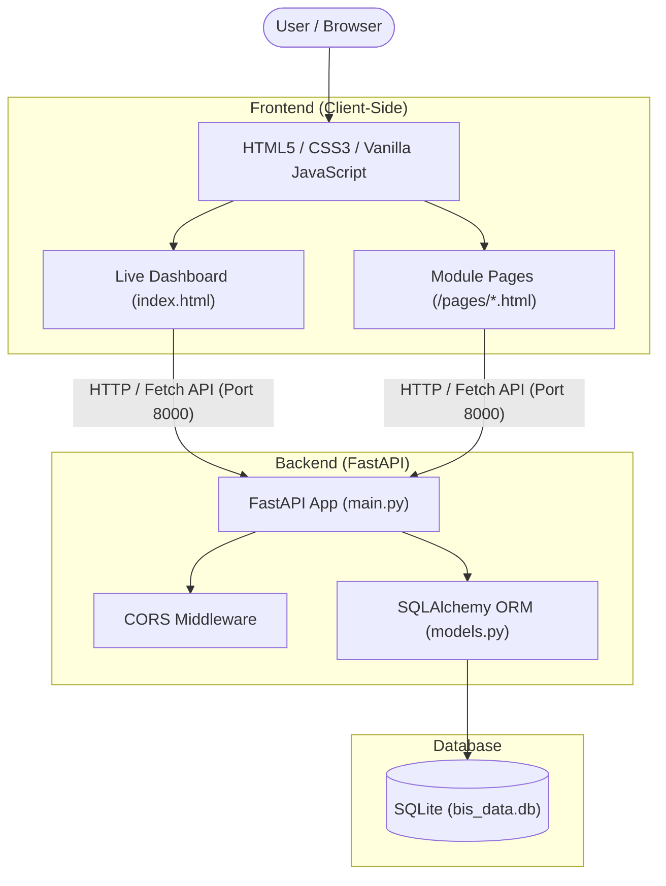

# 🇮🇳 BIS SmartAssist

> **Intelligent Digital Assistance Platform for Indian Standards & BIS Services**  
> *Smart India Hackathon (SIH) Prototype*

---

## 📌 Overview

**BIS SmartAssist** is a unified digital platform developed to simplify access to services and information provided by the **Bureau of Indian Standards (BIS)**. Designed as a prototype for the Smart India Hackathon (SIH), the application bridges the gap between citizens, manufacturers, testing laboratories, and regulatory bodies by offering an intuitive interface powered by a high-performance REST API backend.

The platform provides quick standard lookups, certification roadmaps, lab searches, hallmarking/HUID information, consumer rights awareness, training program details, and an interactive **AI SmartAssist** interface.

---

## 🌟 Key Features

| Feature | Description |
| :--- | :--- |
| 🔍 **Smart Standard Finder** | Search Indian Standards (IS) by standard number (e.g., `IS 10500`), product name, or keyword with real-time filtering and official BIS links. |
| 📜 **Certification Navigator** | Comprehensive guidance on ISI Mark Scheme-I, Compulsory Registration Scheme (CRS), Foreign Manufacturers Certification Scheme (FMCS), and step-by-step application procedures. |
| 🧪 **Laboratory Finder** | Search BIS-recognized laboratories across India by location, lab code, or testing scope with direct links to the BIS LIMS portal. |
| 🏅 **Hallmarking & HUID Guide** | Educational portal explaining precious metal hallmarking, purity metrics (caratage & fineness), and 6-digit Hallmark Unique Identification (HUID) tracking via the BIS Care App. |
| 🛡️ **Consumer Support** | Guidance on consumer protection, reporting substandard products, and filing online grievances through official portals. |
| 🎓 **Training & Capacity Building** | Information on training programs organized by the National Institute of Training for Standardization (NITS) for industry and regulatory stakeholders. |
| 🤖 **AI SmartAssist** | Natural language assistant that guides users to the correct BIS resources, standards, and procedures based on conversational queries. |
| 📊 **Live Dashboard** | Real-time statistics displaying available standards, registered laboratories, and active services dynamically fetched from the database. |

---

## 🏗️ Architecture & Tech Stack



### **Backend**
- **Framework**: [FastAPI](https://fastapi.tiangolo.com/) (Python ASGI Framework)
- **Server**: [Uvicorn](https://www.uvicorn.org/)
- **ORM / Database**: [SQLAlchemy](https://www.sqlalchemy.org/) with **SQLite**
- **Validation**: Pydantic

### **Frontend**
- **Core**: HTML5, CSS3, Vanilla JavaScript (ES6+ async/await & Fetch API)
- **Styling**: Custom CSS with responsive card grids, accessible typography, and official Indian government web design aesthetic
- **Zero Heavy Dependencies**: Pure browser-native JavaScript for maximum performance and fast load times

---

## 📁 Repository Structure

```text
BIS-SmartAssist/
├── README.md                          # Project Documentation
└── BIS-SmartAssist/
    ├── index.html                     # Main Landing Page & Live Dashboard
    ├── assets/                        # Images, badges, and official logos
    ├── css/
    │   └── style.css                  # Global stylesheet & design system
    ├── js/
    │   └── script.js                  # Frontend utility scripts
    ├── pages/                         # Core module pages
    │   ├── assistant.html             # AI SmartAssist conversational interface
    │   ├── certification.html         # BIS Certification schemes & guide
    │   ├── consumer.html              # Consumer rights & complaints
    │   ├── hallmarking.html           # Hallmarking & HUID details
    │   ├── laboratories.html          # BIS-recognized laboratory finder
    │   ├── standards.html             # Smart Standard Finder
    │   └── training.html              # NITS Training & capacity building
    └── backend/                       # FastAPI REST Backend
        ├── main.py                    # API routes, search logic, CORS config
        ├── models.py                  # SQLAlchemy database models
        ├── database.py                # Database connection & session factory
        ├── seed.py                    # Database seeding script
        ├── migrate.py                 # Schema migration helper
        └── data/
            └── bis_data.db            # SQLite database file
```

---

## 🚀 Quick Start Guide

### 1. Prerequisites
- **Python 3.10+** (Tested on Python 3.13)
- **pip** (Python package installer)
- Modern web browser (Chrome, Edge, Firefox, etc.)

---

### 2. Backend Setup

#### a. Navigate to the backend directory:
```bash
cd backend
```

#### b. Install dependencies:
```bash
pip install fastapi uvicorn sqlalchemy
```

#### c. Initialize the Database (Optional / First-time setup):
The repository comes with a pre-populated SQLite database in `backend/data/bis_data.db`. If you need to re-seed or reset the database:
```bash
python seed.py
```

#### d. Start the Backend Server:
```bash
python -m uvicorn main:app --host 127.0.0.1 --port 8000 --reload
```
The server will start at:
- **API Base URL**: `http://127.0.0.1:8000`
- **Interactive Swagger Docs**: `http://127.0.0.1:8000/docs`
- **ReDoc Documentation**: `http://127.0.0.1:8000/redoc`

---

### 3. Frontend Setup

You can run the frontend in either of two ways:

#### Method A: Direct Browser Execution
Open `index.html` directly in your web browser.

#### Method B: Local Static Server (Recommended)
From the directory containing `index.html`, start a lightweight HTTP server:
```bash
python -m http.server 5500
```
Then visit `http://127.0.0.1:5500` in your browser.

---

## 📡 API Reference

The backend provides REST endpoints consumed by the frontend modules:

### 1. System & Dashboard
| Endpoint | Method | Description |
| :--- | :---: | :--- |
| `/` | `GET` | API health check and status message |
| `/api/dashboard` | `GET` | Platform statistics, list of services, and official BIS links |

### 2. Standards
| Endpoint | Method | Query / Path Params | Description |
| :--- | :---: | :--- | :--- |
| `/api/standards` | `GET` | `?q=<search_query>` | List or search standards by IS number, title, or category |
| `/api/standards/{standard_id}` | `GET` | `standard_id` (int) | Get detailed information for a specific standard |
| `/api/standards/category/{category}` | `GET` | `category` (string) | Filter standards by industrial/engineering category |

### 3. Laboratories
| Endpoint | Method | Query / Path Params | Description |
| :--- | :---: | :--- | :--- |
| `/api/labs` | `GET` | `?q=<search_query>` | List or search recognized labs by code, name, city, or scope |

### 4. Static Knowledge & Service Endpoints
| Endpoint | Method | Description |
| :--- | :---: | :--- |
| `/api/hallmarking` | `GET` | Hallmarking rules, HUID details, and verification steps |
| `/api/consumer` | `GET` | BIS Care App features, consumer rights, and complaint URLs |
| `/api/training` | `GET` | NITS training programs, participant eligibility, and calendar links |

---

## 🔗 Official BIS References

- **Bureau of Indian Standards Official Portal**: [https://www.bis.gov.in](https://www.bis.gov.in/?lang=en)
- **Know Your Standard (e-BIS)**: [https://standards.bis.gov.in](https://standards.bis.gov.in/)
- **Product Certification & Manakonline**: [https://www.manakonline.in](https://www.manakonline.in/)
- **BIS LIMS (Laboratory Information Management System)**: [https://lims.bis.gov.in](https://lims.bis.gov.in/home/labs/)
- **BIS Care Mobile App**: Available on Google Play Store & Apple App Store

---

## 📄 License & Attribution
Developed as an educational prototype for the **Smart India Hackathon (SIH)**. All official logos, Indian Standard specifications, and trademarks are property of the **Bureau of Indian Standards, Government of India**.
